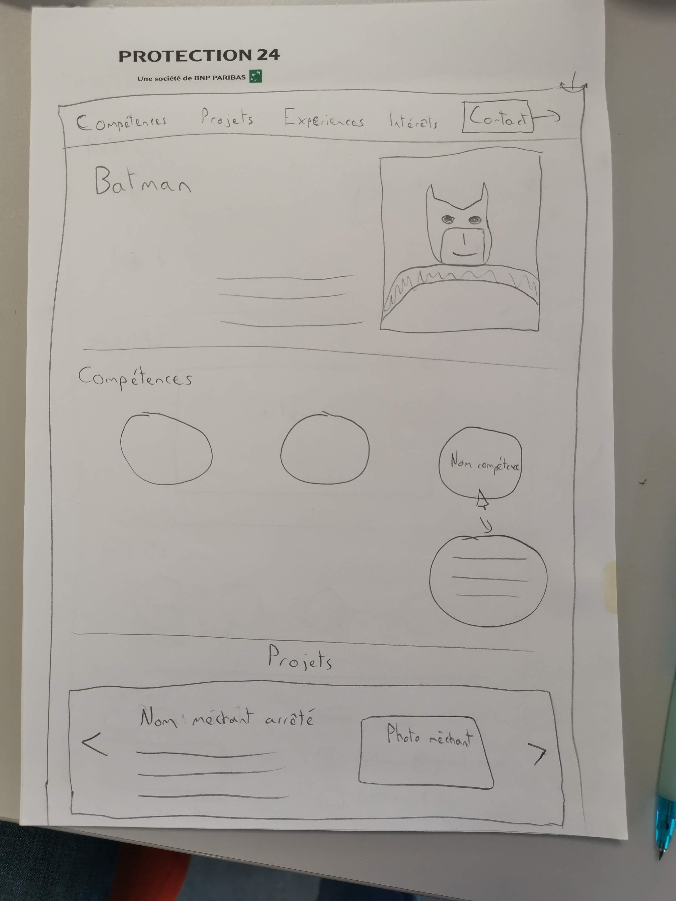
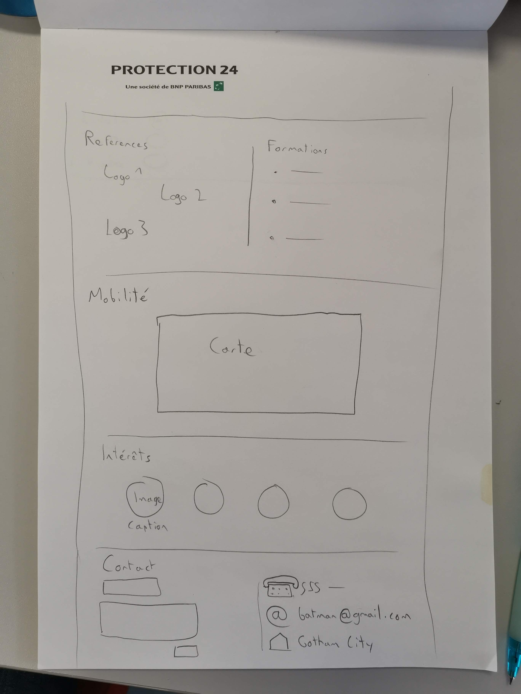
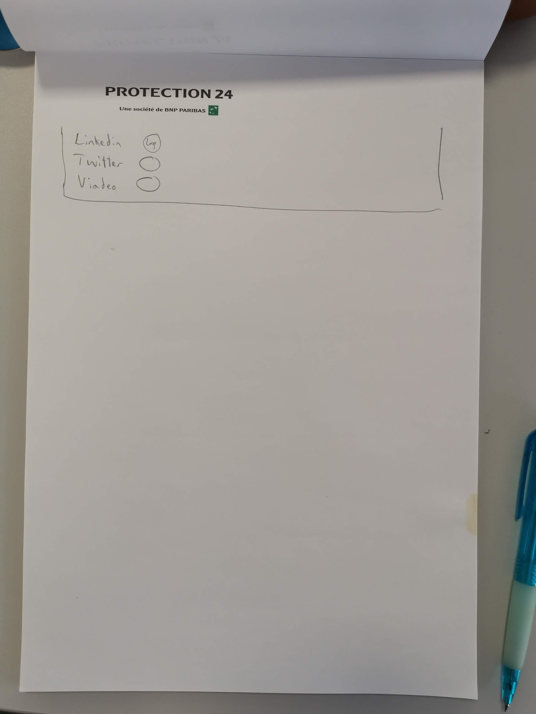

# cvBatman
## Equipe : 
>Julien / Anthony / Yannice / Oleg / Julien

## Durée du projet:
> du 9/03/2020 au 14/03/2020

## But: 
> Construction d'un cv en ligne pour Monsieur Batman

## Description des fonctionnalitées:

### Menu/navbar: 
>En mode paralax avec la nav bar en fixed en top

### Compétences: 
> Apparition au click d'une page  avec modification du pointeur au survol de compétence.

## Liste projet: 

#### Référence: 
>une liste de logo clickable

#### Formation: 
>nom de formation  avec lien vers les écoles éventuels

#### Mobilité: 
>google maps

#### hobbies: 
>petite bulle image avec figcaption

#### Contact: 
>création de formulaire en colonne / avec adresse à coté

#### Footer: 
>lien linkedin / lien twitter